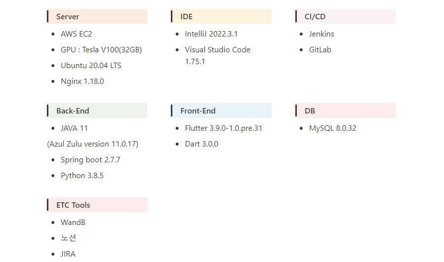
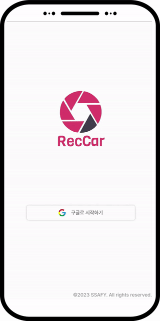
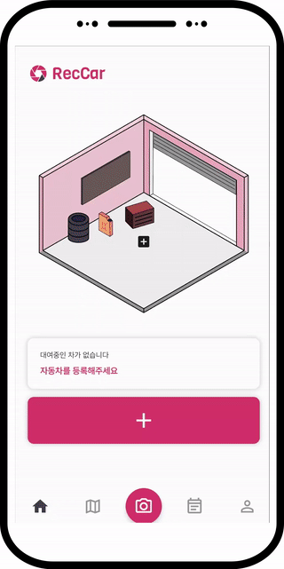

# 🚗RecCar 자동차 손상 관리 서비스

### 프로젝트 진행 기간

2023.02.27(월) ~ 2023.04.07(금)

## Team Members

<div align="left">
  <table>
    <tr>
        <td align="center">
        <a href="">
          
        </a>
      </td>
      <td align="center">
        <a href="">
          
        </a>
      </td>
      <td align="center">
        <a href="">
          
        </a>
      </td>
      <td align="center">
        <a href="">
          
        </a>
      </td>
      <td align="center">
        <a href="">
          
        </a>
      </td>
      <td align="center">
        <a href="">
          
        </a>
      </td>
    </tr>
    <tr>
      <td align="center">
        <a href="https://github.com/variety82/">
          김창현
        </a>
      </td>
      <td align="center">
        <a href="https://github.com/Woong1201">
          김영웅
        </a>
      </td>
      <td align="center">
        <a href="https://github.com/TannyKim">
          김태균
        </a>
      </td>
      <td align="center">
        <a href="https://github.com/songheewon">
          원송희
        </a>
      </td>
      <td align="center">
        <a href="https://github.com/ldhldh07">
          임두현
        </a>
      </td>
        <td align="center">
        <a href="">
          임주연
        </a>
      </td>
    </tr>
  </table>
</div>


## 🚦등장 배경

관광지, 휴가 등에서 차량 대여 서비스 이용 후 분쟁을 겪으신 적이 있으신가요?

과도한 위약금, 사고 발생 후 수리비, 면책금 부과까지 다양한 문제들이 서비스 이용자들을 괴롭히곤 합니다.

차량 대여시 꼭 필요한 손상 기록 절차, 하지만 제대로 기록하지 못하는 경우가 많습니다.

### 당신의 소중한 여행, 휴가가 되도록 저희 RecCar가 지켜드리겠습니다

## 개요

렉카(RecCar)는 AI를 이용한 차량 파손 손상 인식 및 기록 서비스입니다.

손상을 자동으로 캡쳐해주고 캡쳐된 기록을 확인할 수 있게 해줍니다.

이로써 렌트 및 차량대여를 이용하는 소비자들이 수월하게 서비스를 이용할 수 있도록 도와줍니다.

## Usage

```
git clone https://lab.ssafy.com/s08-ai-image-sub2/S08P22A102.git
이후 exec폴더의 포팅메뉴얼을 따라 진행
```

### 개발환경 및 기술 스택



## Product Flow


## Service Architecture


### 📂디렉토리 구조

<details>
  <summary>
  백엔드 디렉토리 구조(Java)
  </summary>


    ├─main
    │  ├─java
    │  │  └─com
    │  │      └─heros
    │  │          ├─api
    │  │          │  ├─calendar
    │  │          │  │  ├─controller
    │  │          │  │  ├─dto
    │  │          │  │  │  ├─request
    │  │          │  │  │  └─response
    │  │          │  │  ├─entity
    │  │          │  │  ├─repository
    │  │          │  │  └─service
    │  │          │  ├─car
    │  │          │  │  ├─controller
    │  │          │  │  ├─dto
    │  │          │  │  │  ├─request
    │  │          │  │  │  └─response
    │  │          │  │  ├─entity
    │  │          │  │  ├─repository
    │  │          │  │  └─service
    │  │          │  ├─detectionInfo
    │  │          │  │  ├─controller
    │  │          │  │  ├─dto
    │  │          │  │  │  ├─request
    │  │          │  │  │  └─response
    │  │          │  │  ├─entity
    │  │          │  │  ├─repository
    │  │          │  │  └─service
    │  │          │  ├─example
    │  │          │  │  ├─controller
    │  │          │  │  └─model
    │  │          │  └─user
    │  │          │      ├─controller
    │  │          │      ├─dto
    │  │          │      │  ├─request
    │  │          │      │  └─response
    │  │          │      ├─entity
    │  │          │      ├─repository
    │  │          │      └─service
    │  │          ├─common
    │  │          ├─config
    │  │          └─exception
    │  │              └─customException
    │  └─resources

 </details>

### 

<details>
  <summary>
  백엔드 디렉토리 구조(Python)
  </summary>


    ├─dataset
    │  ├─images
    │  ├─output_images
    │  └─video
    ├─images
    ├─models
    ├─service
    ├─src
    ├─app.py
    ├─inference.py
    ├─requirements.txt
    └─Utils

 </details>


<details>
  <summary>
  프론트엔드 디렉토리 구조
  </summary>


    ├─assets
    │  ├─car_video
    │  ├─fonts
    │  └─images
    │      ├─car_damage_img
    │      └─loading_img
    ├─provider
    │  └─car_damage_info_provider
    ├─screens
    │  ├─after_check_damage_screen
    │  ├─after_recording_screen
    │  ├─before_recording_screen
    │  ├─calendar_screen
    │  ├─check_car_damage_screen
    │  ├─check_video_screen
    │  ├─detail
    │  ├─home
    │  ├─login_screen
    │  ├─map_screen
    │  ├─my_page
    │  ├─register
    │  ├─splash_screen
    │  └─video_recording_screen
    ├─services
    ├─utils
    └─widgets
        ├─check_car_damage
        ├─common
        ├─detail
        ├─main_page
        ├─my_page
        └─register

 </details>

## Dataset

- AIHub 개방 데이터셋


- 전체 이미지 개수 : 504,450 장 중 50,000장 사용(Train : 35,000장, Validation : 15,000장)

- 3 class : 스크래치(Scratch), 찌그러짐(Crushed), 파손(Breakage)

## Experiments


### 🚗 **차량 파손 Segmentation**

**Task** : 차량 이미지로 부터 각 클래스에 해당하는 영역을 Segmentation

**Metric** : mIoU

| Model | Backbone | mIoU |
| ----- | -------- | ---- |
| Unet  | ResNet34 | 0.72 |


## 💡 Model Installation Guide

```
cd APP/modles
Scratch, Breakage, Crushed클래스를 학습한 모델의 pt파일이 존재합니다.
```

## 📓 Train Usage

```
1) 학습할 데이터에 맞춰 json파일을 생성해야 합니다.
학습할 데이터들을 넣고 AI/utils의 make_damage_labeling.ipynb를 실행하여 damage_labeling.csv를 생성합니다.

cd data/datainfo 위치에 앞서 학습할 데이터에 맞게 만들어놓은 damage_labeling.csv를 위치 시킨 후
cd AI위치에서 아래 명령어를 실행합니다.
python code/src/Utils.py --make_cocoformat 1 --task damage

2)Train
cd AI/code로 이동하여 아래 명령어를 실행합니다.
python main.py --train y --task damage --label all
```


## 주요기능 및 화면

### 소셜 로그인(로그인 & 로그아웃(구글OAuth))

- RecCar의 로그인은 소셜 로그인 방식으로 이루어집니다.
- 현재 소셜 로그인은 구글 계정으로만 가능합니다.
- 로그인 완료 시, 자동으로 홈 화면으로 이동합니다.

<div align="center">
	
</div>

### 근처 렌트카존 찾기

- 화면 하단의 Footer에서 지도 아이콘을 클릭할 시, 렌트카존 찾기 화면으로 이동합니다.
- 하단의 ‘쏘카존 보기’, ‘그린존 보기’를 클릭할 시 해당 렌트카 존이 어디에 있는지를 시각적으로 확인할 수 있습니다.
- 상단의 검색 바에 검색어를 입력할 경우, 해당 검색어와 관련된 지점의 정보를 하단의 모달에서 확인할 수 있습니다.
  - 각 항목을 클릭할 시 현재 위치에서 해당 지점까지 도보로 얼마나 걸리는지도 확인이 가능합니다.

<div align="center">
    
</div>

### 일정관리(차량 대여 및 반납 일자)

- 화면 하단의 Footer에서 캘린더 아이콘을 선택할 시, 일정 관리 화면으로 이동합니다.
- 일정 관리 화면에서는 현재 날짜에 맞춘 달력과, 각 일자에 따른 일정 목록을 확인할 수 있습니다.
- 화면 하단 우측의 플로팅 버튼(+)을 클릭할 시, 새롭게 일정을 추가할 수 있습니다.
  - 일정 추가 시, 제목(TITLE)과 해당되는 날짜, 그리고 메모(MEMO)를 입력하게 됩니다.
- 차량 대여 시, 대여 일정과 반납 일정이 해당 일자에 맞춰 자동으로 추가됩니다.
- 한 번 등록한 일정은 수정과 삭제가 가능합니다.
  - 단, 차량 대여 시 자동으로 생성된 일정의 경우 삭제가 불가능합니다.

<div align="center">

</div>

### 차량 영상 등록

- 홈 화면 또는 화면 하단 Footer의 카메라 아이콘 버튼을 클릭할 시 차량 손상을 등록하는 것이 가능합니다.
- AI로 분석할 차량 영상의 경우 직접 촬영하거나, 이미 촬영한 영상을 갤러리에서 선택하여 업로드하는 방법 총 두 가지가 존재합니다.
  - 영상 촬영을 선택했을 경우, 촬영 후 영상 확인이 가능합니다.
- 영상 촬영 또는 선택 후, 일정 시간 동안 AI를 통한 분석이 진행되며, 분석이 완료되었을 시 차량 손상 확인 페이지로 이동합니다.

<div align="center">

</div>
